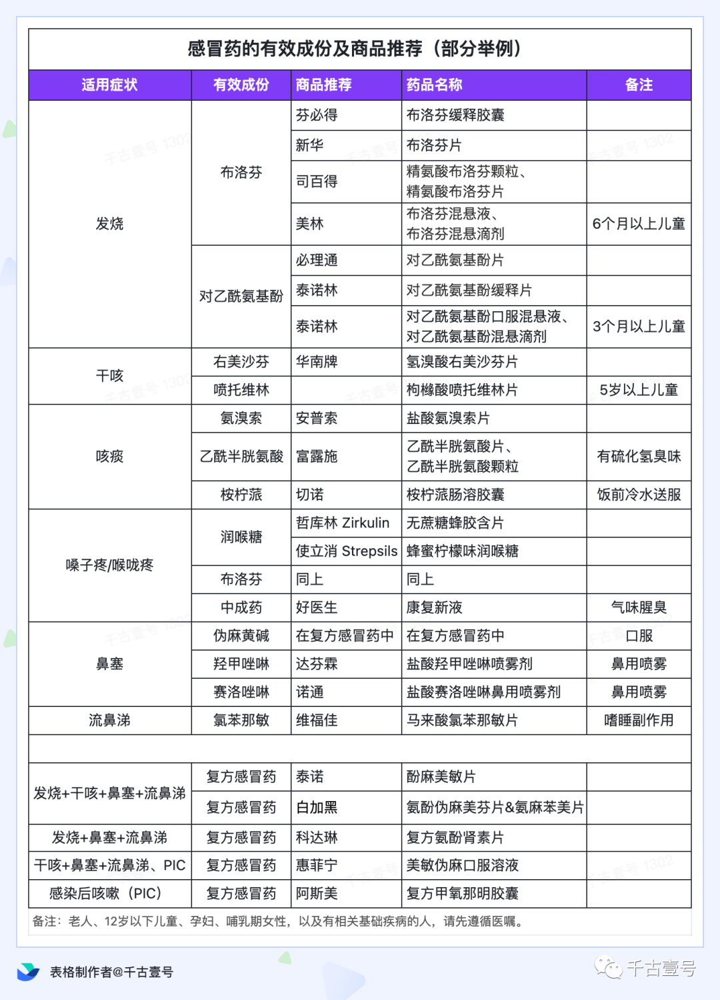

## 感冒

### 速查
- 解热镇痛：对乙酰氨基酚、布洛芬；
- 缓解鼻塞、流涕、打喷嚏：氯苯那敏、苯海拉明；
- 缓解鼻塞：伪麻黄碱；
- 镇咳：右美沙芬、布桂嗪。

### 引用
- https://sspai.com/post/84574
- https://mp.weixin.qq.com/s/6E2aTUWyFStN4qmn4LWlKQ

## 手册
- [默沙东诊疗手册](https://www.msdmanuals.cn/home)